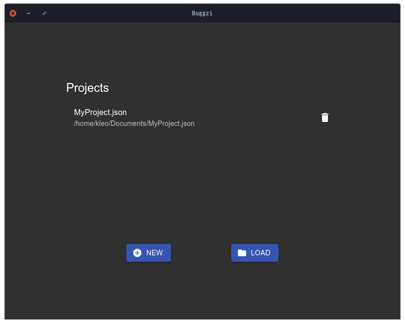
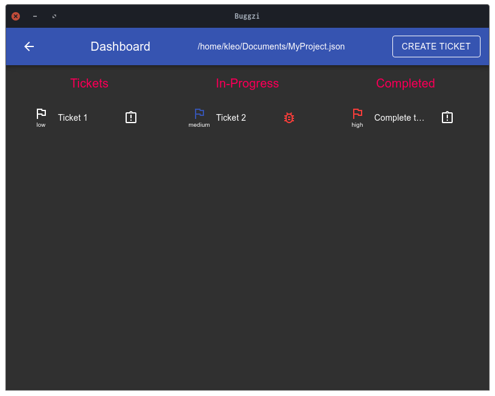
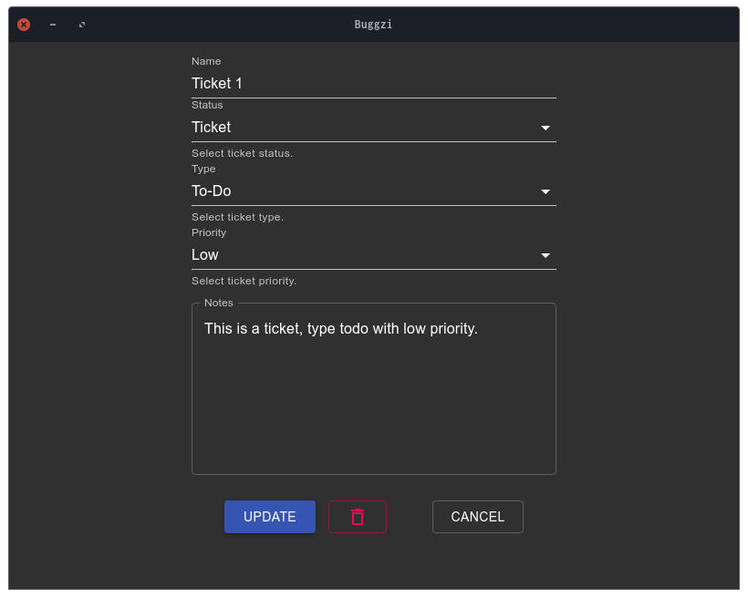

<p align="center">
	
</p>

# Buggzi-Desktop [ALPHA VERSION]

A cross platform bug tracking application for small teams and individual developers. Stay on track with Buggzi on any system.

---

<p align="center">
	
	
	
</p>

---

## Getting Started

Clone:

```git
git clone https://github.com/KleoHasani/Buggzi-Desktop.git
```

Install dependencies:

```npm
npm install
```

Start:

```npm
npm start
```

### Required

- Electron v12.0.7

- Electron Builder v22.10.5

- Node v16.3.0

- NPM v7.15.1

### Build With

- Electron Builder v22.10.5

Build:

```npm
npm run build
```

Windows:

- dist/_installer_.exe

Debian:

- dist/_installer_.deb

- dist/_installer_.AppImage

### Testing

#### E2E

1.  Build

    ```npm
    npm run build
    ```

2.  Test

    ```npm
    npm run test:e2e
    ```

#### UI

```npm
npm run test:ui
```

#### Unit

```npm
npm run test:unit
```

## Version

v0.0.3

## Authors

Kleo Hasani

## Notes

Support for:

- [x] Windows 10

- [x] Debian 10

- [x] AppImage
