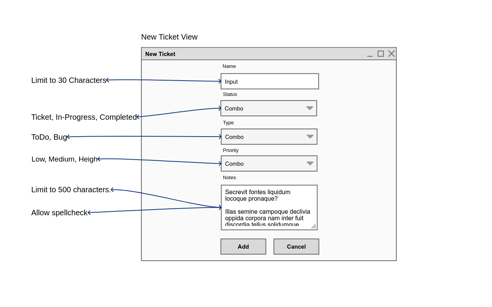
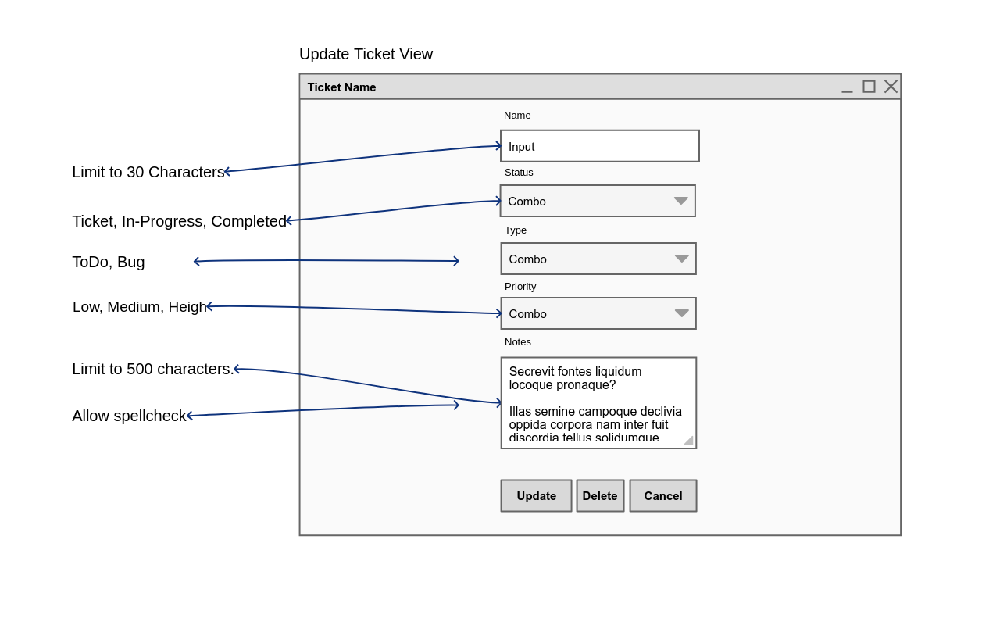

<h2>Software Design Document</h2>
<h3>Buggzi-Desktop</h3>

Authors: Kleo Hasani

<i>SDD v1.0</i>

---

# Context

## Goal

Buggzi is a cross platform bug tracking software intended for small teams and individual developers. Our goal is to make the developement of software easier. With Buggzi you can track tickets, bugs or issues and to-do's. All in a convinint database that can be imported into any project or system.

# User Requirements

Only one user/project manager should be allowed to perform crud operations on this software to prevent data merge conficts.

# User Interface

Main Window

</img>

Dashboard Window

</img>

New Ticket View

</img>

Update Ticket View

</img>

